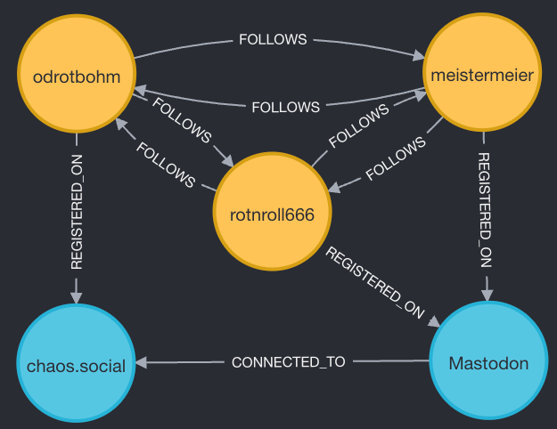
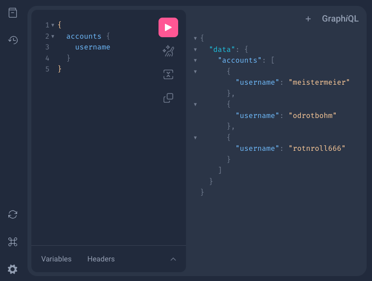
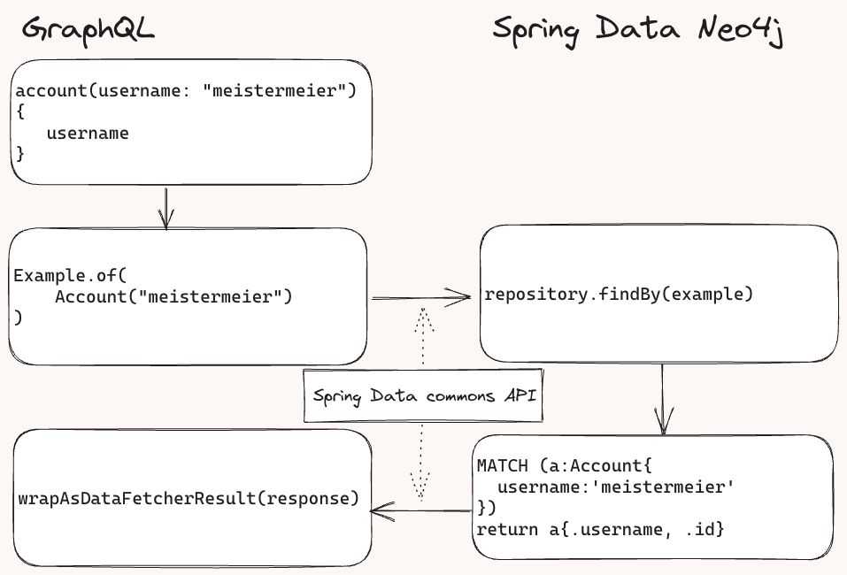

= Using Spring for GraphQL with Spring Data Neo4j

== Introduction

A few weeks ago version 1.2.0 of Spring (for) GraphQL was released with a bunch of new features.
This also includes even better integration with Spring Data modules.
Motivated by those changes, more support in Spring Data Neo4j has been added, to give the best experience when using it in combination with Spring GraphQL.
This post will guide you on creating a Spring application with data stored in Neo4j and GraphQL support.
If you are only partial interested in the domain, you can happily skip the next section ;)

== Domain

For this example I have chosen to reach into the Fediverse.
More concrete, to put some _Servers_ and _User_ into the focus.
Why the domain was picked up for this, is now for the reader to discover in the following paragraphs.

The data itself is aligned to the properties that could be fetched from the https://docs.joinmastodon.org/[Mastodon API].
To keep the data set simple the data was created by hand instead of fetching _everything_.
This results into an easier to inspect data set.
The Cypher import statements looks like this:

.Cypher import
[source,cypher]
----
include::../src/test/resources/neo4j/migrations/V0001__Create_fediverse_dataset.cypher[]
----

After running the statement, the graph forms this shape.

.Graph view of data set

Noticeable information is that even all users follow each others, the Mastodon servers are only connected in one direction.
Users on server _chaos.social_ cannot search or explore timelines on _mastodon.social_.

_Disclaimer:_ The federation of the servers is made up with a non-bidirectional relationship for this example.

== Components

To follow along with the example shown, you should use the following minimum versions:

* Spring Boot 3.1.1 (which includes the following)
** Spring Data Neo4j 7.1.1
** Spring GraphQL 1.2.1

* Neo4j version 5

Best is to head over to https://start.spring.io and create a new project with Spring Data Neo4j and Spring GraphQL dependency.
If you are a little bit lazy, you could also download the empty project from
https://start.spring.io/#!type=maven-project&language=java&platformVersion=3.1.1&packaging=jar&jvmVersion=17&groupId=com.example.neo4jgraphql&artifactId=neo4j-graphql&name=neo4j-graphql&description=Example%20project%20to%20integrate%20GraphQL%20with%20Neo4j&packageName=com.example.neo4j-graphql&dependencies=graphql,data-neo4j[this link].

To follow along the example 100%, you would need to have Docker installed on your system.
If you don't have this option or don't want to use Docker,
you could use either https://neo4j.com/download/[Neo4j Desktop] or the plain https://neo4j.com/download-center/#community[Neo4j Server] artifact for local deployment,
or as hosted options https://console.neo4j.io[Neo4j Aura] or an https://neo4j.com/sandbox/[empty Neo4j Sandbox].
There will be a note later how to connect to a manual started instance.
The use of the enterprise edition is not necessary and everything works with the community edition.

== First Spring for GraphQL steps

In this example the heavy lifting of configuration will be done by the Spring Boot autoconfiguration.
There is no need to set up the beans manually.
To find out more about what happens behind the scenes, please have a look at the https://docs.spring.io/spring-graphql/docs/current/reference/html/[Spring for GraphQL documentation].
Later, specific sections of the documentation will be referenced.

== Entity and Spring Data Neo4j setup

First thing to do is to model the domain classes.
As already seen in the import, there are only `Servers` and `Accounts`.

.Account domain class
[source,java]
----
include::../src/main/java/com/meistermeier/neo4j/graphql/Account.java[tags=blog_post]
----
<.> Given https://shkspr.mobi/blog/2022/12/snowflake-ids-in-mastodon-and-unique-ids-in-the-fediverse-more-generally/[Mastodon's id strategy for user ids],
it is valid to assume, that the id is (server) unique.
<.> Here and a few lines below in the `Server`, `@Property` is used to map the database field _display_name_ to camel-case _displayName_ in the Java entity.

.Server domain class
[source,java]
----
include::../src/main/java/com/meistermeier/neo4j/graphql/Server.java[tags=blog_post]
----

With these entity classes, a `AccountRepository` can be created.

.Account repository
[source, java]
----
include::../src/main/java/com/meistermeier/neo4j/graphql/AccountRepository.java[tags=blog_post]
----
<.> Details why this annotation is used will follow later. Here for completeness of the interface.

To connect to the Neo4j instance, the connection parameters needs to be added to the _application.properties_ file.

[source,properties]
----
spring.neo4j.uri=neo4j://localhost:7687
spring.neo4j.authentication.username=neo4j
spring.neo4j.authentication.password=verysecret
----

If not happened yet, the database can be started and the Cypher statement from above run to set up the data.
In a later part of this article, https://michael-simons.github.io/neo4j-migrations/[Neo4j-Migrations] will get used to be sure that the database is always in the desired state.

== Spring for GraphQL setup

Before looking into the integration features of Spring Data and Spring for GraphQL,
the application will get set up with a `@Controller` stereotype annotated class.
The controller will get registered by Spring for GraphQL as a `DataFetcher` for the query _accounts_.

[source,java]
----
@Controller
public class AccountController {

    private final AccountRepository repository;

    @Autowired
    public AccountController(AccountRepository repository) {
            this.repository = repository;
    }

    @QueryMapping
    public List<Account> accounts() {
            return repository.findAll();
    }
}
----

Defining a GraphQL schema, that defines not only our entities but also the query with the same name as
the method in the controller (_accounts_).

[source,graphqls]
----
include::../src/main/resources/graphql/schema.graphqls[tags=schema;query;first_example]
----

Also, to browse the GraphQL data in an easy way, GraphiQL should be enabled in the _application.properties_.
This is a helpful tool during development time.
Usually this should be disabled for production deployment.

[source,properties]
----
spring.graphql.graphiql.enabled=true
----

== First run

If everything is set up as described above, the application can be started with `./mvnw spring-boot:run`.
Browsing to http://localhost:8080/graphiql?path=/graphql will present the GraphiQL explorer.

.Querying in GraphiQL

To verify that the `accounts` method is working, a GraphQL request is sent to the application.

.First GraphQL request
[source,graphql]
----
{
  accounts {
    username
  }
}
----

and the expected answer gets returned from the server.

.GraphQL response
[source,json]
----
{
  "data": {
    "accounts": [
      {
        "username": "meistermeier"
      },
      {
        "username": "rotnroll666"
      },
      {
        "username": "odrotbohm"
      }
    ]
  }
}
----

Of course the method in the controller can be tweaked by adding parameters for respecting arguments with `@Argument`
or getting the requested fields (here _accounts.username_) to squeeze down the amount of data that gets transported
over the network.
In the previous example, the repository will fetch all properties for the given domain entity, including all relationships.
This data will get mostly discarded to return only the _username_ to the user.

This example should give an impression of what can be done with https://docs.spring.io/spring-graphql/docs/current/reference/html/#controllers[Annotated Controllers].
Adding the query generation and mapping capabilities of Spring Data Neo4j a (simple) GraphQL application was created.

But at this point both libraries seem to live in parallel in this application and not yet like an integration.
How can SDN and Spring for GraphQL get _really_ combined?

== Spring Data Neo4j GraphQL integration

As a first step, the `accounts` method from the `AccountController` can be deleted.
Restarting the application and querying it again with the request from above will still bring up the same result.

This works because Spring for GraphQL recognizes the result type (array of) `Account` from the GraphQL schema.
It scans for eligible Spring Data repositories that matches the type.
Those repositories have to extend the `QueryByExampleExecutor` or `QuerydslPredicateExecutor` (not part of this blog post) for the given type.
In this example, the `AccountRepository` is already implicitly marked as `QueryByExampleExecutor` because it is extending the `Neo4jRespository`, that is already defining the executor.
The `@GraphQlRepository` annotation makes Spring for GraphQL aware that this repository can and should be used for the queries, if possible.

Without any changes to the actual code, a second _Query field_ can be defined in the schema.
This time it should filter the results by username.
A username looks unique at the first glance but in the Fediverse this is only true for a given instance.
Multiple instances could have the very same usernames in place.
To respect this behaviour, the query should be able to return an array of `Accounts`.

The documentation about https://docs.spring.io/spring-data/commons/docs/current/reference/html/#query-by-example[query by example (Spring Data commons)] provides more details
about the inner workings of this mechanism.

.Updated query type
[source,graphql]
----
include::../src/main/resources/graphql/schema.graphqls[tags=query;second_example]
----

Restarting the app will now present the option to add a username interactively as a parameter to the query.

.Query for an array of the same username
[source,graphql]
----
{
  account(username: "meistermeier") {
    username
    following {
      username
      server {
        uri
      }
    }
  }
}
----

Obviously, there is only one `Account` with this username.

.Response for query by username
[source,json]
----
{
  "data": {
    "account": [
      {
        "username": "meistermeier",
        "following": [
          {
            "username": "rotnroll666",
            "server": {
              "uri": "mastodon.social"
            }
          },
          {
            "username": "odrotbohm",
            "server": {
              "uri": "chaos.social"
            }
          }
        ]
      }
    ]
  }
}
----

Behind the scenes Spring for GraphQL adds the field as a parameter to the object that gets passed to the repositories as an example.
Spring Data Neo4j then inspects the example and creates matching conditions for the Cypher query, executes it and sends the result back to Spring GraphQL
for further processing to shape the result into the right response format.

.(schematic) API call flow

== Pagination

Although the example data set is not this huge, it's often useful to have a proper functionality in place that allows to request the resulting data in chunks.
Spring for GraphQL uses the https://relay.dev/graphql/connections.htm[Cursor Connections specification].

A complete schema specification with all types looks like this.

.Schema with cursor connections
[source,graphql]
----
include::../src/main/resources/graphql/schema.graphqls[tags=query;schema;connection_schema;connection_query]
----

Even though I personally like to have a complete valid schema, it is possible to skip all the _Cursor Connections_ specific parts in the definition.
Just the query with the `AccountConnection` definition is sufficient for Spring for GraphQL to derive and fill in the missing bits.
The parameters read as following

* `first`: the amount of data to fetch if there is no default
* `after`: scroll position after the data should be fetched
* `last`: the amount of data to fetch before the `before` position
* `before`: scroll position until (exclusive) the data should be fetched

One question remains:
In which order is the result set returned?
A stable sort order is a *must* in this scenario, otherwise there is no guarantee that the database returns the data in a predictable order.
The repository needs also to extend the `QueryByExampleDataFetcher.QueryByExampleBuilderCustomizer` and implement the `customize` method.
In there it is also possible to add the default limit for the query, in this case _1_ to show the pagination in action.

.Added sort ordering (and limit)
[source,java]
----
include::../src/main/java/com/meistermeier/neo4j/graphql/AccountRepository.java[tags=blog_post;sort_order]
----

After the application has restarted, it is now possible to call the first pagination query.

.Pagination for the first element
[source,graphql]
----
{
  accountScroll {
    edges {
      node {
        username
      }
    }
    pageInfo {
      hasNextPage
      endCursor
    }
  }
}
----

To get also the metadata for further interaction, some parts of the `pageInfo` got also requested.

.Result for the first element
[source,json]
----
{
  "data": {
    "accountScroll": {
      "edges": [
        {
          "node": {
            "username": "meistermeier"
          }
        }
      ],
      "pageInfo": {
        "hasNextPage": true,
        "endCursor": "T18x"
      }
    }
  }
}
----

Now the `endCursor` can be used for the next interaction.
Querying the application with this as the value for _after_ and with a limit of 2...

.Pagination for the last element
[source,graphql]
----
{
  accountScroll(after:"T18x", first: 2) {
    edges {
      node {
        username
      }
    }
    pageInfo {
      hasNextPage
      endCursor
    }
  }
}
----

...results in the last element(s).
Also, the marker that there is no next page (`hasNextPage=false`) indicates that the pagination reached the end of the data set.

.Result for the last element
[source,json]
----
{
  "data": {
    "accountScroll": {
      "edges": [
        {
          "node": {
            "username": "odrotbohm"
          }
        },
        {
          "node": {
            "username": "rotnroll666"
          }
        }
      ],
      "pageInfo": {
        "hasNextPage": false,
        "endCursor": "T18z"
      }
    }
  }
}
----

It is also possible to scroll through the data backwards by using the defined `last` and `before` parameters.
Also, it is completely valid to combine this scrolling with the already known features of query by example
and define a query in the GraphQL schema that also accepts fields of the `Account` as filter criteria.

.Filter with pagination
[source,text]
----
accountScroll(username:String, first: Int, after: String, last: Int, before:String): AccountConnection
----

== Let's federate

One of the big advantages in using GraphQL is the option to introduce federated data.
In a nutshell this means that data stored, e.g. in the database of the application, can be enriched, like in this case,
with data from a remote system / microservice / <you name it>.
In the end, the data will get presented via the GraphQL surface as one entity.
The consumer should not need to care about that multiple systems assembled this result.

This data federation can be implemented by making use of the already defined controller.

.SchemaMapping for federated data
[source,java]
----
@Controller
public class AccountController {

    @SchemaMapping
    public String lastMessage(Account account) {
        var id = account.getId();
        String serverUri = account.getServer().getUri();

        WebClient webClient = WebClient.builder()
                        .baseUrl("https://" + serverUri)
                        .build();

        return webClient.get()
                        .uri("/api/v1/accounts/{id}/statuses?limit=1", id)
                        .exchangeToMono(clientResponse ->
                            clientResponse.statusCode().equals(HttpStatus.OK)
                            ? clientResponse
                                    .bodyToMono(String.class)
                                    .map(AccountController::extractData)
                            : Mono.just("could not retrieve last status")
                        )
                        .block();
    }

}
----

Adding the field `lastMessage` to the `Account` in the schema and restarting the application,
gives now the option to query for the accounts with this additional information.

.Query with federated data
[source,graphql]
----
{
  accounts {
    username
    lastMessage
  }
}
----

.Response with federated data
[source,json]
----
{
  "data": {
    "accounts": [
      {
        "username": "meistermeier",
        "lastMessage": "@taseroth erst einmal schauen, ob auf die Aussage auch Taten folgen ;)"
      },
      {
        "username": "odrotbohm",
        "lastMessage": "Some #jMoleculesp/#SpringCLI integration cooking to easily add the former[...]"
      },
      {
        "username": "rotnroll666",
        "lastMessage": "Werd aber das Rad im Rückwärts-Turbo schon irgendwie vermissen."
      }
    ]
  }
}
----

Looking at the controller again, it becomes clear that the retrieval of the data is quite a bottleneck right now.
For every `Account` a request gets issued after another.
But Spring for GraphQL helps to improve the situation of the ordered requests for each `Account` after another.
The solution is to use https://docs.spring.io/spring-graphql/docs/current/reference/html/#controllers.batch-mapping[`@BatchMapping`] on the _lastMessage_ field in contrast to `@SchemaMapping`.

.BatchMapping for federated data
[source,java,options=[]]
----
include::../src/main/java/com/meistermeier/neo4j/graphql/AccountController.java[tags=body;federation_batch_mapping]
----

To improve this situation even more, it is recommended to also introduce proper caching to the result.
It might not be necessary that the federated data gets fetched on every request but only refreshed after a certain period.

== Testing and test data

=== Neo4j-Migrations

https://michael-simons.github.io/neo4j-migrations/[Neo4j-Migrations] is a project that applies migrations to Neo4j.
To be sure that always a clean state of the data is present in the database, an initial Cypher statement is provided.
It has the same content as the Cypher snippet in the beginning of this post.
In fact, the content is included directly from this file.

Putting Neo4j-Migrations on the classpath by providing the Spring Boot starter,
it will run all migrations from the default folder (_resources/neo4j/migrations_).

.Neo4j-Migrations dependency definition
[source,xml]
----
include::../pom.xml[tags=neo4j_migrations,indent=0]
----

=== Testcontainers

Spring Boot 3.1 comes with a new features for https://testcontainers.org[Testcontainers].
One of this feature is the automatic setting of properties without the need to define `@DynamicPropertySource`.
The (to Spring Boot known) properties will get populated at test execution time after the container has started.

First the dependency definition for https://testcontainers.com/modules/neo4j/[Testcontainers Neo4j] is needed in our _pom.xml_.

.Testcontainers dependency definition
[source,xml]
----
include::../pom.xml[tags=testcontainers_neo4j,indent=0]
----

To make use of Testcontainers Neo4j, a container definition _interface_ will be created.

.Container configuration
[source,java]
----
include::../src/test/java/com/meistermeier/neo4j/graphql/Neo4jContainerConfiguration.java[tags=blog_post]
----

This can then be used with the `@ImportTestContainers` annotation in the (integration) test class.

.Test annotated with `@ImportTestContainers`
[source,java]
----
include::../src/test/java/com/meistermeier/neo4j/graphql/Neo4jGraphqlApplicationTests.java[tags=blog_post]
----

For completeness this test class also includes the `GraphQlTester` and an example how to test the application's GraphQL API.

=== Testcontainers at development time

It is also now possible to run the whole application directly from the test folder and use a Testcontainers image.

.Application start with container from test class
[source,java]
----
include::../src/test/java/com/meistermeier/neo4j/graphql/TestNeo4jGraphqlApplication.java[tags=blog_post]
----

The `@ServiceConnection` annotation also takes care that the application started from the test class knows
the coordinates the container is running at (connection string, username, password...).

To start the application outside the IDE, it is now also possible to invoke `./mvnw spring-boot:test-run`.
If there is only one class with a main method in the test folder, it will get started.

== Topics left out / Try it

In parallel to the `QueryByExampleExecutor`, support for `QuerydslPredicateExecutor` exists in the Spring Data Neo4j module.
To make use of it, the repository needs to extend the `CrudRepository` instead of the `Neo4jRepository` and also declare it
as a `QuerydslPredicateExecutor` for the given type.
Adding support for scrolling/pagination would require to also add the `QuerydslDataFetcher.QuerydslBuilderCustomizer` and implement its `customize` method.

The whole infrastructure presented in this blog post is also available for the reactive stack.
Basically prefixing everything with `Reactive...` (like `ReactiveQuerybyExampleExecutor`) will turn this into a reactive application.

Last but not least, the scroll mechanism used here is based on an `OffsetScrollPosition`.
There is also a https://docs.spring.io/spring-graphql/docs/current/reference/html/#data.pagination.scroll.keyset[`KeysetScrollPosition`] that can be used.
It makes use of the sort property/properties in combination with the defined id.

[source,java]
----
@Override
default QueryByExampleDataFetcher.Builder<Account, ?> customize(QueryByExampleDataFetcher.Builder<Account, ?> builder) {
	return builder.sortBy(Sort.by("username"))
			.defaultScrollSubrange(new ScrollSubrange(ScrollPosition.keyset(), 1, true));
}
----

== Summary

It's nice to see how convenient methods in Spring Data modules do not only provide a broader accessibility for users' use-cases,
but also get used by other Spring projects to reduce the amount of code that needs to be written.
This results in less maintenance for the existing code base and helps focussing on the business problem instead of infrastructure.

This post got a little bit longer because I explicitly want to touch at least the surface on what is happening when a query gets invoked
without speaking just about the _automagical_ result.

Please go ahead and explore more about what is possible and how the application behaves for different types of queries.
It is near to impossible to cover every topic and feature that is available within one blog post.

Happy GraphQL coding and exploring.